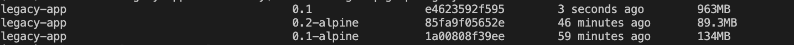

# Building Node Docker Image

> Best practices for smaller, better images

- Use the base image for development.  It includes git, python and many other important development tools
- Use the alpine image to deploy to production.  It is the smallest image possible.  An example is in the branch `alpine`

